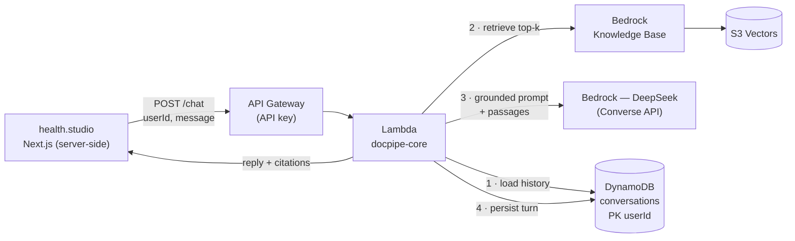
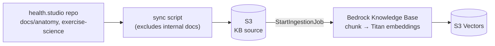
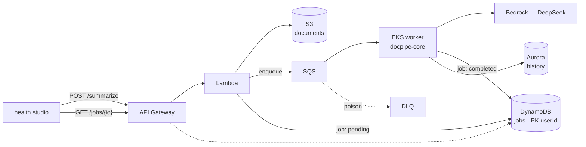

# docpipe — health.studio AI services on AWS

The AWS-hosted AI backend for [health.studio](https://health.studio): a chat
assistant and an async document-summarization pipeline, called server-side by
the health.studio Next.js app (which runs on its own infra). Built on:

**Bedrock (DeepSeek) · Lambda · EKS · DynamoDB · API Gateway · S3 · RDS (Aurora) · VPC · IAM · CloudWatch · SQS — provisioned with Terraform.**

## How it works

Three cycles. The **chat path** and the **summary path** share one Python
package (`docpipe-core`); the **knowledge-base ingestion** runs offline and
feeds the chat path.

### 1. Chat — synchronous, grounded in the knowledge base

A user question is answered from health.studio's evidence-graded corpus, with
citations. Latency-sensitive, so it's Lambda with no queue.



The passages carry their source URIs and evidence ratings; the system prompt
tells DeepSeek to cite what it used and to say so when the KB doesn't cover the
question, instead of guessing.

### 2. Knowledge-base ingestion — offline, runs when the docs change

health.studio's public anatomy / exercise-science docs become searchable
vectors. Not in any request path — runs on demand (or in CI).



Vectors live in **S3 Vectors** (not OpenSearch Serverless) — serverless and
near-zero cost at rest, which keeps the whole chat path permanently
deployable.

### 3. Summaries — asynchronous, decoupled by a queue

Training logs / session notes are summarized off the request path, because LLM
calls are slow and must not block the caller.



The compute split is deliberate: **Lambda** for the spiky request edge,
**EKS** for the long-running consumer. Everything is per-user (opaque IDs from
the app; no PII/PHI crosses to AWS), and the chat path can stay up permanently
while the EKS + Aurora side is torn down between sessions.

## Health & privacy constraints

- The assistant is **non-diagnostic**: system prompt forbids diagnosis and
  prescriptions, and directs red-flag symptoms to a clinician (mirrors the
  red-flag gate already in the health.studio app).
- **Grounded, not vibes**: answers are anchored to the same evidence-graded,
  publicly-sourced knowledge base the app publishes — with citations — and
  the assistant admits when the KB doesn't cover a topic.
- **No PII/PHI leaves health.studio**: the app sends anonymous conversation
  content keyed by opaque user/conversation IDs — no names, emails, or
  account data. The KB contains only public content.
- All calls are server-to-server; the browser never talks to this API.

## Repo layout

```
packages/core/     docpipe-core: models, storage, queue, Bedrock chat +
                   summarization clients, observability. Reused everywhere.
services/api/      Lambda handlers behind API Gateway.
services/worker/   FastAPI SQS consumer, containerized, deployed to EKS.
infra/             Terraform. Reusable modules + a dev environment.
```

## Infra / secrets split

Everything in this repo is public by design. What never enters git:

- `terraform.tfstate` — lives in a remote S3 backend (native lockfile, TF ≥ 1.10)
- real `*.tfvars` — only `terraform.tfvars.example` is committed
- credentials — AWS auth via SSO/environment, never in code

See [`infra/README.md`](infra/README.md) for the module map and
[`PLAN.md`](PLAN.md) for the build phases and current status.

## Dev quickstart

```bash
uv sync --all-packages         # install workspace incl. dev deps (Python 3.12)
uv run pytest                  # shared package tests
make fmt lint typecheck        # ruff + mypy, terraform fmt
```

## Cost notes

This stack is not free-tier: EKS control plane (~$73/mo), NAT gateway
(~$32/mo), Aurora. The dev environment is built to be created and destroyed
per session (`make infra-up` / `make infra-down`), with Aurora Serverless v2
at minimum ACU and a single NAT gateway. The sync chat path alone (API
Gateway + Lambda + Bedrock + DynamoDB) costs near-zero at rest — it can stay
up permanently while the EKS/Aurora side is torn down between sessions.
