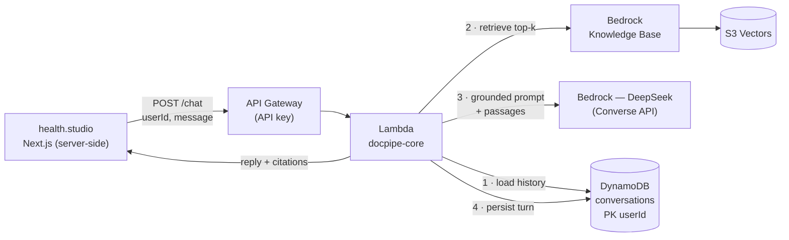
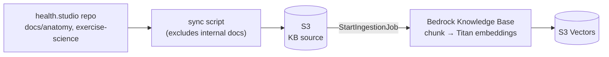
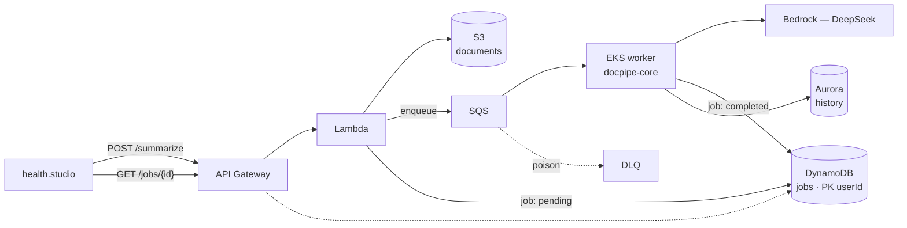

# docpipe — health.studio AI services on AWS

The AWS-hosted AI backend for [health.studio](https://health.studio): a chat
assistant and an async document-summarization pipeline, called server-side by
the health.studio Next.js app (which runs on its own infra). Built on:

**Bedrock (DeepSeek) · Lambda · DynamoDB · API Gateway · S3 · RDS (Aurora) · VPC · IAM · CloudWatch · SQS — provisioned with Pulumi (Python).**

## How it works

Three cycles. The **chat path** and the **summary path** share one Python
package (`docpipe-core`); the **knowledge-base ingestion** runs offline and
feeds the chat path.

### 1. Chat — synchronous, grounded in the knowledge base

A user question is answered from health.studio's evidence-graded corpus, with
citations. Latency-sensitive, so it's Lambda with no queue.



The passages carry their source URIs and evidence ratings; the system prompt
tells DeepSeek to cite what it used and to say so when the KB doesn't cover the
question, instead of guessing.

### 2. Knowledge-base ingestion — offline, runs when the docs change

health.studio's public anatomy / exercise-science docs become searchable
vectors. Not in any request path — runs on demand (or in CI).



Vectors live in **S3 Vectors** (not OpenSearch Serverless) — serverless and
near-zero cost at rest, which keeps the whole chat path permanently
deployable.

### 3. Summaries — asynchronous, decoupled by a queue

Training logs / session notes are summarized off the request path, because LLM
calls are slow and must not block the caller.



The compute split is deliberate: **Lambda** for the spiky request edge,
**EKS** for the long-running consumer. Everything is per-user (opaque IDs from
the app; no PII/PHI crosses to AWS), and the chat path can stay up permanently
while the EKS + Aurora side is torn down between sessions.

## Health & privacy constraints

- The assistant is **non-diagnostic**: system prompt forbids diagnosis and
  prescriptions, and directs red-flag symptoms to a clinician (mirrors the
  red-flag gate already in the health.studio app).
- **Grounded, not vibes**: answers are anchored to the same evidence-graded,
  publicly-sourced knowledge base the app publishes — with citations — and
  the assistant admits when the KB doesn't cover a topic.
- **No PII/PHI leaves health.studio**: the app sends anonymous conversation
  content keyed by opaque user/conversation IDs — no names, emails, or
  account data. The KB contains only public content.
- All calls are server-to-server; the browser never talks to this API.

## Repo layout

```
packages/core/     docpipe-core: models, storage, queue, Bedrock chat +
                   summarization clients, observability. Reused everywhere.
services/api/      Lambda handlers behind API Gateway.
services/worker/   SQS consumer for async summaries (compute TBD — see PLAN).
pulumi/            Pulumi (Python). One component per concern, dev stack.
```

## Infra / secrets split

Everything in this repo is public by design. What never enters git:

- Pulumi state — lives in a self-managed S3 backend (`pulumi login s3://…`)
- credentials — AWS auth via profile/SSO/environment, never in code

See [`pulumi/README.md`](pulumi/README.md) for the component map and
[`PLAN.md`](PLAN.md) for the build phases and current status.

## Dev quickstart

```bash
uv sync --all-packages         # install workspace incl. dev deps (Python 3.12)
uv run pytest                  # shared package tests
make fmt lint typecheck        # ruff + mypy
make status                    # live stack snapshot → dashboard.html
```

### `make status`

Probes the deployed stack and writes `status.json` + a self-contained
`dashboard.html`: resource inventory (Pulumi state), per-service health and
metrics (DynamoDB, S3, SQS, KB, guardrail, VPC), Bedrock model availability,
month-to-date cost (Cost Explorer), and build progress parsed from `PLAN.md`.
Every probe is independent — a missing permission degrades one card instead of
failing the run. Both files are gitignored; regenerate rather than commit.

## Cost notes

The foundation is designed to cost **~$0 at rest**. There is deliberately **no
NAT gateway** — nothing needs VPC egress (the chat Lambda runs outside the VPC;
the KB is serverless S3 Vectors; Aurora uses the RDS Data API). The VPC,
subnets, gateway endpoints, DynamoDB (on-demand), SQS, S3, and S3 Vectors are
all free or pay-per-use at rest.

Nothing deployed today has a standing cost. The sync chat path (API Gateway +
Lambda + Bedrock + DynamoDB + KB) can stay up permanently; `make infra-down`
tears down everything when idle. Worker compute (Phase 5) is still an open
decision — EKS would be the one always-on cost (~$73/mo), which is why Lambda
is the default recommendation.

**The four classic budget sinks in this stack — and how we avoid them:**

| Sink | If you're careless | Our design |
|------|-------------|------------|
| NAT gateway | ~$32/mo idle | **Removed** — no VPC egress needed |
| OpenSearch Serverless (vector store) | ~$345/mo floor | **S3 Vectors** instead |
| EKS control plane | ~$73/mo always-on | Phase 5 only; tear down when idle (reconsider vs Lambda/Fargate) |
| Aurora warm cluster | ~$43/mo+ | `min_capacity = 0` → **auto-pauses**, idle ≈ $0; ~$0.12/ACU-hr only while serving; gated off by default |

### Deliberate trade-offs (not just "picked the cheap option")

- **Aurora `min_capacity = 0` costs a cold first query.** When the cluster has
  auto-paused, the first connection pays a resume latency before it serves.
  We accept that because the summary worker is async — a few seconds on the
  first job after idle is invisible to users. *Measured resume time (Phase 5,
  once Aurora is live): **TODO — time it and record the number here.***
- **Titan v2 embeddings pinned to 1024 dims** (`dimensions = 1024`), matching
  the S3 Vectors index. Chosen once, up front — the index can't mix dimensions.
